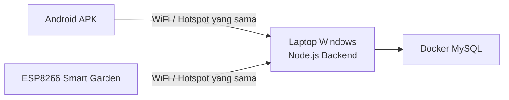

# SmartGarden Local-Only

[Beranda](README.md) |
[1 Persiapan](docs/01_PERSIAPAN.md) |
[2 Server Lokal](docs/02_INSTALASI_SERVER_LOKAL.md) |
[3 Android](docs/03_SETUP_APLIKASI_ANDROID.md) |
[4 ESP8266](docs/04_SETUP_ESP8266.md) |
[5 Wiring](docs/05_WIRING_RANGKAIAN.md) |
[6 Penggunaan](docs/06_CARA_PENGGUNAAN.md) |
[7 Troubleshooting](docs/07_TROUBLESHOOTING.md) |
[8 Checklist](docs/08_CHECKLIST_CLIENT.md)

SmartGarden adalah sistem penyiraman tanaman otomatis dan manual.

Sistem ini berjalan di jaringan lokal.

Artinya:

- Tidak memakai hosting cloud.
- Tidak memakai database cloud.
- Laptop Windows menjadi server lokal.
- Android dan ESP8266 harus tersambung ke WiFi atau hotspot yang sama.

> [!IMPORTANT]
> Laptop harus menyala saat sistem SmartGarden digunakan.
> Jika laptop mati, Android dan ESP8266 tidak bisa mengakses server lokal.

## Fitur utama

- Monitoring kelembapan tanah.
- Monitoring suhu udara.
- Monitoring kelembapan udara.
- Mode Automatic.
- Mode Manual.
- Kontrol pompa dari Android.
- Pengaturan threshold kelembapan.
- Jadwal penyiraman.
- Riwayat sensor.
- Riwayat penyiraman.

## Gambaran sistem

Penjelasan sederhana:

- Android adalah aplikasi untuk melihat data dan memberi perintah.
- ESP8266 adalah alat yang membaca sensor dan mengontrol relay pompa.
- Backend adalah program server yang berjalan di laptop.
- MySQL adalah tempat penyimpanan data sensor dan log penyiraman.
- Docker membantu menjalankan MySQL dengan mudah.

## Alat yang dibutuhkan

### Hardware

- NodeMCU ESP8266.
- Soil Moisture Sensor.
- DHT11.
- Relay module.
- Pompa air DC.
- LCD I2C.
- Kabel jumper.
- Breadboard atau PCB.
- Power supply sesuai kebutuhan pompa.
- Laptop Windows.
- HP Android.

### Software

- Git atau fitur Download ZIP dari GitHub.
- Docker Desktop.
- Node.js.
- Android APK SmartGarden.
- Arduino IDE.
- Driver CH340 jika ESP8266 tidak terdeteksi.

## Urutan instalasi

## Quick Start 5 langkah

Gunakan ini jika kamu sudah pernah memakai GitHub dan terminal.

- [ ] Clone atau download repository ini.
- [ ] Jalankan server lokal dengan `scripts\start-local.bat`.
- [ ] Cari IP laptop dengan `scripts\show-ip.bat`.
- [ ] Masukkan IP laptop di aplikasi Android.
- [ ] Upload firmware ESP8266 setelah mengisi `config.h`.

Jika kamu baru pertama kali, ikuti panduan lengkap dari awal:

1. [Persiapan alat dan software](docs/01_PERSIAPAN.md)
2. [Instalasi server lokal](docs/02_INSTALASI_SERVER_LOKAL.md)
3. [Setup aplikasi Android](docs/03_SETUP_APLIKASI_ANDROID.md)
4. [Setup ESP8266](docs/04_SETUP_ESP8266.md)
5. [Wiring rangkaian](docs/05_WIRING_RANGKAIAN.md)
6. [Cara penggunaan](docs/06_CARA_PENGGUNAAN.md)
7. [Troubleshooting](docs/07_TROUBLESHOOTING.md)
8. [Checklist client](docs/08_CHECKLIST_CLIENT.md)

## Screenshot yang perlu ditambahkan

> 📸 Screenshot yang perlu ditambahkan:
> - Tampilan Docker Desktop berjalan
> - Terminal backend berhasil aktif
> - Lokasi IPv4 dari `ipconfig`
> - Pengaturan Server Lokal pada APK
> - Arduino IDE sebelum upload

## Catatan keamanan

> [!WARNING]
> Jangan masukkan password WiFi asli ke GitHub.
> File `firmware/esp8266-smartgarden/config.h` memang tidak boleh di-commit.

> [!TIP]
> Jika bingung, mulai dari dokumen nomor 1.
> Jangan lompat langkah.

[Beranda](README.md) |
[1 Persiapan](docs/01_PERSIAPAN.md) |
[2 Server Lokal](docs/02_INSTALASI_SERVER_LOKAL.md) |
[3 Android](docs/03_SETUP_APLIKASI_ANDROID.md) |
[4 ESP8266](docs/04_SETUP_ESP8266.md) |
[5 Wiring](docs/05_WIRING_RANGKAIAN.md) |
[6 Penggunaan](docs/06_CARA_PENGGUNAAN.md) |
[7 Troubleshooting](docs/07_TROUBLESHOOTING.md) |
[8 Checklist](docs/08_CHECKLIST_CLIENT.md)
