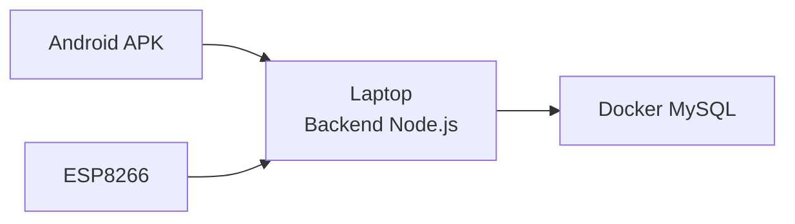

# 02 - Instalasi Server Lokal

[Beranda](../README.md) |
[1 Persiapan](01_PERSIAPAN.md) |
[2 Server Lokal](02_INSTALASI_SERVER_LOKAL.md) |
[3 Android](03_SETUP_APLIKASI_ANDROID.md) |
[4 ESP8266](04_SETUP_ESP8266.md) |
[5 Wiring](05_WIRING_RANGKAIAN.md) |
[6 Penggunaan](06_CARA_PENGGUNAAN.md) |
[7 Troubleshooting](07_TROUBLESHOOTING.md) |
[8 Checklist](08_CHECKLIST_CLIENT.md)

Server lokal adalah program yang berjalan di laptop Windows.

Server ini menerima data dari ESP8266 dan aplikasi Android.

> [!IMPORTANT]
> Laptop harus menyala saat sistem dipakai.
> HP Android dan ESP8266 harus berada di WiFi atau hotspot yang sama dengan laptop.

## Alur server lokal



## 1. Clone atau download repository

### Pilihan A: memakai Git

Buka PowerShell.

Masuk ke folder tempat kamu ingin menyimpan project.

Contoh:

```powershell
cd "$env:USERPROFILE\Documents"
```

Clone repository:

```powershell
git clone https://github.com/Catalism-1/SmartGarden.git
```

Masuk ke folder project:

```powershell
cd SmartGarden
```

Hasil yang diharapkan:

- Folder `SmartGarden` berhasil dibuat.
- Di dalamnya ada folder `app`, `backend-api`, `firmware`, `docs`, dan `scripts`.

### Pilihan B: download ZIP

- [ ] Buka halaman GitHub repository SmartGarden.
- [ ] Klik tombol `Code`.
- [ ] Klik `Download ZIP`.
- [ ] Extract ZIP.
- [ ] Buka folder hasil extract.

> [!TIP]
> Jika belum familiar dengan Git, gunakan Download ZIP lebih mudah.

## 2. Salin file environment

Environment adalah file pengaturan lokal.

File contoh sudah tersedia:

```text
backend-api\.env.example
```

Kita perlu menyalinnya menjadi:

```text
backend-api\.env
```

Jalankan dari root folder project:

```powershell
Copy-Item backend-api\.env.example backend-api\.env
```

Hasil yang diharapkan:

- File `backend-api\.env` muncul.
- Isinya berisi pengaturan database lokal.

> [!WARNING]
> Jangan upload file `.env` ke GitHub.
> File ini hanya untuk laptop lokal.

## 3. Jalankan Docker MySQL

Pastikan Docker Desktop sudah terbuka.

Jalankan:

```powershell
docker compose up -d
```

Hasil yang diharapkan:

```text
Container smartgarden-mysql Started
```

Cek status:

```powershell
docker compose ps
```

Hasil yang diharapkan:

```text
smartgarden-mysql   Up
```

Jika Docker error, buka [Troubleshooting](07_TROUBLESHOOTING.md).

## 4. Jalankan backend Node.js

Masuk ke folder backend:

```powershell
cd backend-api
```

Install dependency:

```powershell
npm install
```

Hasil yang diharapkan:

```text
added ... packages
found 0 vulnerabilities
```

Jalankan backend:

```powershell
npm start
```

Hasil yang diharapkan:

```text
SmartGarden API listening on http://0.0.0.0:3000
```

> [!IMPORTANT]
> Biarkan terminal ini tetap terbuka.
> Jika terminal ditutup, backend ikut berhenti.

> 📸 Screenshot yang perlu ditambahkan:
> - Terminal backend berhasil aktif

## 5. Cara mudah memakai script

Jika ingin lebih praktis, dari root project jalankan:

```powershell
.\scripts\start-local.bat
```

Script ini akan:

- Membuat `.env` jika belum ada.
- Menjalankan Docker MySQL.
- Menerapkan schema database.
- Menjalankan backend.

## 6. Cari IPv4 laptop

Buka PowerShell baru.

Jalankan:

```powershell
ipconfig
```

Cari bagian WiFi.

Cari tulisan:

```text
IPv4 Address
```

Contoh:

```text
IPv4 Address. . . . . . . . . . . : 192.168.1.10
```

Angka `192.168.1.10` adalah IP laptop.

> 📸 Screenshot yang perlu ditambahkan:
> - Lokasi IPv4 dari `ipconfig`

> [!TIP]
> IP laptop bisa berubah setelah pindah WiFi atau restart router.
> Jika Android tiba-tiba offline, cek IP lagi.

## 7. Test endpoint health

Endpoint adalah alamat API.

Buka browser laptop.

Masukkan:

```text
http://localhost:3000/api/health
```

Hasil yang diharapkan:

```json
{
  "success": true,
  "message": "SmartGarden API is healthy",
  "data": {
    "service": "smartgarden-backend-api",
    "database": "connected"
  }
}
```

Sekarang test dari HP.

Pastikan HP tersambung ke WiFi yang sama.

Buka browser HP.

Masukkan:

```text
http://192.168.1.10:3000/api/health
```

Ganti `192.168.1.10` dengan IP laptop kamu.

Hasil yang diharapkan:

- JSON muncul di browser HP.
- Nilai `success` adalah `true`.

## 8. Jika HP tidak bisa membuka backend

Kemungkinan firewall Windows memblokir port 3000.

Langkah sederhana:

- [ ] Buka Windows Security.
- [ ] Buka Firewall & network protection.
- [ ] Klik Allow an app through firewall.
- [ ] Izinkan Node.js untuk Private network.
- [ ] Pastikan jaringan WiFi laptop diset sebagai Private.
- [ ] Restart backend.
- [ ] Coba buka `/api/health` lagi dari HP.

> [!WARNING]
> Jangan mematikan firewall sepenuhnya jika tidak perlu.
> Cukup izinkan Node.js atau port 3000 di jaringan private.

## 9. Menghentikan server dengan aman

Untuk menghentikan backend:

- [ ] Klik terminal backend.
- [ ] Tekan `CTRL + C`.

Untuk menghentikan MySQL tanpa menghapus data:

```powershell
docker compose stop
```

Atau gunakan script:

```powershell
.\scripts\stop-local.bat
```

> [!IMPORTANT]
> Jangan memakai command `docker compose down -v`.
> Opsi `-v` dapat menghapus data database.

## Checklist server lokal

- [ ] Repository sudah ada di laptop.
- [ ] File `backend-api\.env` sudah dibuat.
- [ ] Docker Desktop berjalan.
- [ ] Container MySQL status `Up`.
- [ ] Backend berjalan di port 3000.
- [ ] `/api/health` bisa dibuka dari laptop.
- [ ] `/api/health` bisa dibuka dari HP.
- [ ] IP laptop sudah dicatat.

## Lanjut

Jika endpoint health sudah berhasil, lanjut ke:

[03 - Setup Aplikasi Android](03_SETUP_APLIKASI_ANDROID.md)

[Beranda](../README.md) |
[1 Persiapan](01_PERSIAPAN.md) |
[2 Server Lokal](02_INSTALASI_SERVER_LOKAL.md) |
[3 Android](03_SETUP_APLIKASI_ANDROID.md) |
[4 ESP8266](04_SETUP_ESP8266.md) |
[5 Wiring](05_WIRING_RANGKAIAN.md) |
[6 Penggunaan](06_CARA_PENGGUNAAN.md) |
[7 Troubleshooting](07_TROUBLESHOOTING.md) |
[8 Checklist](08_CHECKLIST_CLIENT.md)
