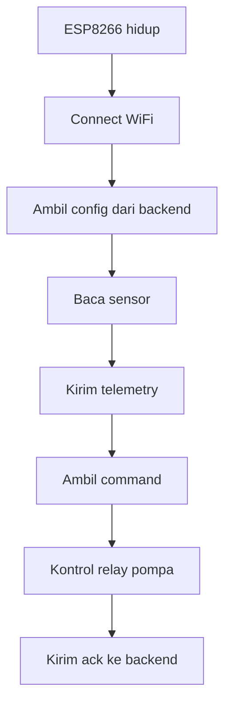

# 04 - Setup ESP8266

[Beranda](../README.md) |
[1 Persiapan](01_PERSIAPAN.md) |
[2 Server Lokal](02_INSTALASI_SERVER_LOKAL.md) |
[3 Android](03_SETUP_APLIKASI_ANDROID.md) |
[4 ESP8266](04_SETUP_ESP8266.md) |
[5 Wiring](05_WIRING_RANGKAIAN.md) |
[6 Penggunaan](06_CARA_PENGGUNAAN.md) |
[7 Troubleshooting](07_TROUBLESHOOTING.md) |
[8 Checklist](08_CHECKLIST_CLIENT.md)

ESP8266 adalah perangkat yang membaca sensor dan mengontrol relay pompa.

Firmware ada di folder:

```text
firmware\esp8266-smartgarden
```

## 1. Install board ESP8266 di Arduino IDE

- [ ] Buka Arduino IDE.
- [ ] Buka `File`.
- [ ] Buka `Preferences`.
- [ ] Cari `Additional boards manager URLs`.
- [ ] Tambahkan URL ESP8266 dari dokumentasi resmi ESP8266 Arduino Core.
- [ ] Klik OK.
- [ ] Buka `Tools`.
- [ ] Buka `Board`.
- [ ] Buka `Boards Manager`.
- [ ] Cari `ESP8266`.
- [ ] Install `esp8266 by ESP8266 Community`.

Hasil yang diharapkan:

- Board `NodeMCU 1.0 (ESP-12E Module)` tersedia.

## 2. Install library

Buka Library Manager.

Install library:

- [ ] ArduinoJson.
- [ ] DHT sensor library.
- [ ] Adafruit Unified Sensor jika diminta.
- [ ] LiquidCrystal I2C.

## 3. Buat config.h

File `config.h` berisi WiFi dan alamat server lokal.

File ini tidak boleh masuk GitHub.

Copy file:

```text
firmware\esp8266-smartgarden\config.example.h
```

Menjadi:

```text
firmware\esp8266-smartgarden\config.h
```

## 4. Isi WiFi dan API_BASE_URL

Buka `config.h`.

Isi bagian ini:

```cpp
#define WIFI_SSID "NAMA_WIFI_KAMU"
#define WIFI_PASSWORD "PASSWORD_WIFI_KAMU"
#define API_BASE_URL "http://192.168.1.10:3000/api"
#define DEVICE_ID "smartgarden-01"
```

Ganti `192.168.1.10` dengan IP laptop kamu.

> [!WARNING]
> Jangan commit `config.h`.
> Jangan kirim password WiFi asli ke GitHub.

## 5. Cara menentukan IP laptop

Di laptop, buka PowerShell.

Jalankan:

```powershell
ipconfig
```

Cari `IPv4 Address` pada adapter WiFi.

Contoh:

```text
192.168.1.10
```

Gunakan IP itu pada `API_BASE_URL`.

## 6. Pilih board dan port

Di Arduino IDE:

- [ ] Pilih `Tools`.
- [ ] Pilih `Board`.
- [ ] Pilih `NodeMCU 1.0 (ESP-12E Module)`.
- [ ] Pilih `Port`.
- [ ] Pilih COM port ESP8266.

Jika port tidak muncul:

- Coba kabel USB lain.
- Install driver CH340.
- Cabut dan colok ulang ESP8266.

## 7. Upload firmware

- [ ] Buka file `esp8266-smartgarden.ino`.
- [ ] Klik tombol Upload.
- [ ] Tunggu sampai selesai.

Hasil yang diharapkan:

```text
Done uploading
```

> 📸 Screenshot yang perlu ditambahkan:
> - Arduino IDE sebelum upload

## 8. Buka Serial Monitor

- [ ] Buka `Tools`.
- [ ] Klik `Serial Monitor`.
- [ ] Set baud rate ke `115200`.

Log sukses yang diharapkan:

```text
WiFi OK
SmartGarden
```

LCD juga harus menampilkan ringkasan data.

## 9. Cara kerja firmware



## 10. Fallback saat backend mati

ESP8266 menyimpan config terakhir.

Jika backend tidak bisa diakses:

- ESP tetap membaca sensor.
- ESP tetap menjalankan mode otomatis dasar.
- ESP memakai threshold terakhir.

## Checklist ESP8266

- [ ] Board ESP8266 sudah terinstall.
- [ ] Library Arduino sudah terinstall.
- [ ] File `config.h` sudah dibuat.
- [ ] WiFi sudah diisi dengan benar.
- [ ] `API_BASE_URL` memakai IP laptop.
- [ ] Board NodeMCU sudah dipilih.
- [ ] Port sudah dipilih.
- [ ] Firmware berhasil di-upload.
- [ ] Serial Monitor bisa dibuka.
- [ ] LCD menampilkan data.

## Lanjut

Jika firmware sudah berhasil upload, lanjut ke:

[05 - Wiring Rangkaian](05_WIRING_RANGKAIAN.md)

[Beranda](../README.md) |
[1 Persiapan](01_PERSIAPAN.md) |
[2 Server Lokal](02_INSTALASI_SERVER_LOKAL.md) |
[3 Android](03_SETUP_APLIKASI_ANDROID.md) |
[4 ESP8266](04_SETUP_ESP8266.md) |
[5 Wiring](05_WIRING_RANGKAIAN.md) |
[6 Penggunaan](06_CARA_PENGGUNAAN.md) |
[7 Troubleshooting](07_TROUBLESHOOTING.md) |
[8 Checklist](08_CHECKLIST_CLIENT.md)
