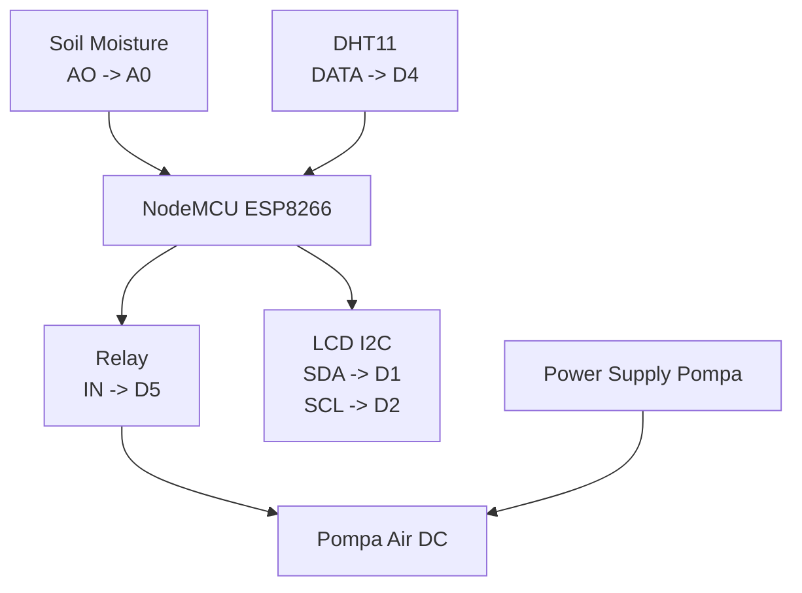

# 05 - Wiring Rangkaian

[Beranda](../README.md) |
[1 Persiapan](01_PERSIAPAN.md) |
[2 Server Lokal](02_INSTALASI_SERVER_LOKAL.md) |
[3 Android](03_SETUP_APLIKASI_ANDROID.md) |
[4 ESP8266](04_SETUP_ESP8266.md) |
[5 Wiring](05_WIRING_RANGKAIAN.md) |
[6 Penggunaan](06_CARA_PENGGUNAAN.md) |
[7 Troubleshooting](07_TROUBLESHOOTING.md) |
[8 Checklist](08_CHECKLIST_CLIENT.md)

Dokumen ini memakai pin yang benar-benar digunakan firmware.

Pin diambil dari:

```text
firmware\esp8266-smartgarden\config.example.h
```

## Tabel wiring ringkas

| Komponen | Pin Komponen | NodeMCU ESP8266 | Catatan |
| --- | --- | --- | --- |
| Soil Moisture Sensor | AO | A0 | Output analog |
| Soil Moisture Sensor | VCC | 3V3 | Ikuti modul sensor |
| Soil Moisture Sensor | GND | GND | Ground bersama |
| DHT11 | DATA | D4 | Data suhu dan kelembapan |
| DHT11 | VCC | 3V3 | Sesuaikan modul |
| DHT11 | GND | GND | Ground bersama |
| Relay Module | IN | D5 | Default active LOW |
| Relay Module | VCC | 5V/VIN | Sesuaikan modul relay |
| Relay Module | GND | GND | Ground bersama |
| LCD I2C | SDA | D1 | Jalur I2C |
| LCD I2C | SCL | D2 | Jalur I2C |
| LCD I2C | VCC | 5V/VIN atau 3V3 | Sesuaikan modul LCD |
| LCD I2C | GND | GND | Ground bersama |
| LED status opsional | Signal | D6 | Gunakan resistor |
| Buzzer opsional | Signal | D7 | Opsional |

## Sensor Soil Moisture

- [ ] Sambungkan `AO` ke `A0`.
- [ ] Sambungkan `VCC` ke `3V3`.
- [ ] Sambungkan `GND` ke `GND`.

> [!TIP]
> Nilai soil sensor perlu dikalibrasi.
> Tanah kering dan tanah basah bisa menghasilkan nilai berbeda tiap sensor.

## DHT11

- [ ] Sambungkan `DATA` ke `D4`.
- [ ] Sambungkan `VCC` ke `3V3`.
- [ ] Sambungkan `GND` ke `GND`.

Jika data DHT11 terbaca `NaN`, cek kabel data dan power.

## Relay

- [ ] Sambungkan `IN` relay ke `D5`.
- [ ] Sambungkan `VCC` relay sesuai modul.
- [ ] Sambungkan `GND` relay ke `GND`.

Firmware default memakai:

```cpp
#define RELAY_ACTIVE_LOW true
```

Artinya banyak modul relay akan aktif saat sinyal LOW.

Jika terbalik, ubah menjadi:

```cpp
#define RELAY_ACTIVE_LOW false
```

## LCD I2C

- [ ] Sambungkan `SDA` ke `D1`.
- [ ] Sambungkan `SCL` ke `D2`.
- [ ] Sambungkan `VCC`.
- [ ] Sambungkan `GND`.

Alamat LCD default firmware:

```cpp
0x27
```

## LED dan buzzer opsional

LED status:

- [ ] Signal ke `D6`.
- [ ] Gunakan resistor.
- [ ] Ground ke `GND`.

Buzzer:

- [ ] Signal ke `D7`.
- [ ] Ground ke `GND`.

## Diagram hubungan sederhana



## Peringatan penting

> [!IMPORTANT]
> Semua GND harus common.
> GND ESP8266, sensor, relay, dan power supply harus terhubung sesuai kebutuhan modul.

> [!WARNING]
> Jangan langsung uji dengan listrik rumah.
> Gunakan pompa DC kecil atau LED untuk uji awal.

> [!WARNING]
> Pompa tidak boleh diberi daya dari pin ESP8266.
> Gunakan power supply terpisah yang sesuai spesifikasi pompa.

> [!TIP]
> Uji relay dulu dengan LED.
> Setelah relay benar, baru hubungkan pompa.

## Checklist wiring

- [ ] Soil sensor AO ke A0.
- [ ] DHT11 DATA ke D4.
- [ ] Relay IN ke D5.
- [ ] LCD SDA ke D1.
- [ ] LCD SCL ke D2.
- [ ] Semua GND sudah benar.
- [ ] Pompa memakai power supply yang sesuai.
- [ ] Relay diuji tanpa pompa dulu.
- [ ] Tidak ada kabel longgar.

## Lanjut

Jika rangkaian sudah siap, lanjut ke:

[06 - Cara Penggunaan](06_CARA_PENGGUNAAN.md)

[Beranda](../README.md) |
[1 Persiapan](01_PERSIAPAN.md) |
[2 Server Lokal](02_INSTALASI_SERVER_LOKAL.md) |
[3 Android](03_SETUP_APLIKASI_ANDROID.md) |
[4 ESP8266](04_SETUP_ESP8266.md) |
[5 Wiring](05_WIRING_RANGKAIAN.md) |
[6 Penggunaan](06_CARA_PENGGUNAAN.md) |
[7 Troubleshooting](07_TROUBLESHOOTING.md) |
[8 Checklist](08_CHECKLIST_CLIENT.md)
