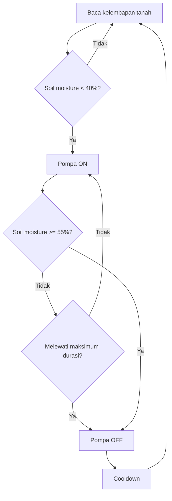

# 06 - Cara Penggunaan

[Beranda](../README.md) |
[1 Persiapan](01_PERSIAPAN.md) |
[2 Server Lokal](02_INSTALASI_SERVER_LOKAL.md) |
[3 Android](03_SETUP_APLIKASI_ANDROID.md) |
[4 ESP8266](04_SETUP_ESP8266.md) |
[5 Wiring](05_WIRING_RANGKAIAN.md) |
[6 Penggunaan](06_CARA_PENGGUNAAN.md) |
[7 Troubleshooting](07_TROUBLESHOOTING.md) |
[8 Checklist](08_CHECKLIST_CLIENT.md)

Dokumen ini menjelaskan cara memakai SmartGarden setelah semua alat siap.

## 1. Nyalakan sistem

- [ ] Nyalakan laptop.
- [ ] Sambungkan laptop ke WiFi atau hotspot.
- [ ] Jalankan server lokal.
- [ ] Sambungkan HP ke WiFi yang sama.
- [ ] Nyalakan ESP8266.

Jalankan server lokal:

```powershell
.\scripts\start-local.bat
```

Hasil yang diharapkan:

```text
SmartGarden API listening on http://0.0.0.0:3000
```

## 2. Membaca dashboard

Dashboard menampilkan:

- Soil Moisture.
- Temperature.
- Humidity.
- Pump status.
- Connection status.

Arti data:

| Data | Arti |
| --- | --- |
| Soil Moisture | Kelembapan tanah dalam persen |
| Temperature | Suhu udara dari DHT11 |
| Humidity | Kelembapan udara dari DHT11 |
| Pump status | Pompa menyala atau mati |
| Connection | Status koneksi ke server lokal |

## 3. Mode Automatic

Mode Automatic membuat ESP8266 menyiram berdasarkan kelembapan tanah.

Default:

- Pompa mulai bila soil moisture `< 40%`.
- Pompa berhenti bila soil moisture `>= 55%`.
- Maksimum durasi pompa default `15 detik`.
- Cooldown default `60 detik`.



Cara memakai:

- [ ] Buka aplikasi.
- [ ] Pilih mode `Automatic`.
- [ ] Pastikan ESP8266 online.
- [ ] Biarkan sensor membaca tanah.

> [!TIP]
> Hysteresis mencegah relay hidup-mati terlalu cepat.
> Start threshold dan stop threshold sengaja berbeda.

## 4. Mode Manual

Mode Manual membuat user mengontrol pompa dari aplikasi.


Cara memakai:

- [ ] Pilih mode `Manual`.
- [ ] Masukkan durasi siram dalam detik.
- [ ] Tekan tombol siram manual.
- [ ] Tunggu ESP8266 mengambil command.
- [ ] Pompa menyala sesuai durasi.

> [!IMPORTANT]
> Backend tidak menyalakan relay langsung.
> Backend hanya menyimpan command.
> ESP8266 yang mengambil command lalu mengontrol relay.

## 5. Menyalakan pompa manual ON/OFF

Di mode Manual:

- [ ] Tekan `ON` untuk membuat command pompa ON.
- [ ] Tekan `OFF` untuk membuat command pompa OFF.

Gunakan ini untuk test relay.

Jangan biarkan pompa menyala terlalu lama saat belum ada air.

## 6. Mengubah threshold

Threshold adalah batas kelembapan.

Start threshold:

- Jika tanah di bawah nilai ini, pompa mulai menyiram.

Stop threshold:

- Jika tanah mencapai nilai ini, pompa berhenti.

Cara mengubah:

- [ ] Buka tab `Schedule`.
- [ ] Atur batas mulai siram.
- [ ] Atur batas berhenti siram.
- [ ] Isi maksimum durasi pompa.
- [ ] Isi cooldown.
- [ ] Tekan `Simpan ke server lokal`.

Contoh aman:

```text
Start threshold: 40%
Stop threshold: 55%
Max duration: 15 detik
Cooldown: 60 detik
```

## 7. Menambah jadwal

Jadwal digunakan untuk menyiram pada waktu tertentu.

Contoh:

```text
Jam 06:00
Durasi 10 detik
Aktif
```

Cara memakai:

- [ ] Buka tab `Schedule`.
- [ ] Aktifkan jadwal.
- [ ] Pilih waktu.
- [ ] Simpan ke server lokal.

> [!TIP]
> Pastikan waktu laptop dan ESP8266 sesuai.
> Jika jadwal tidak berjalan, lihat troubleshooting.

## 8. Membaca histori sensor

Histori sensor menunjukkan data terbaru dari ESP8266.

Data berasal dari endpoint:

```text
/api/garden/history/sensors
```

Di aplikasi:

- [ ] Buka tab `Insights`.
- [ ] Tekan `Perbarui data`.
- [ ] Lihat daftar history sensor.

## 9. Membaca log penyiraman

Log penyiraman berisi:

- Waktu.
- Source.
- Durasi.
- Hasil.
- Soil moisture saat event.

Source bisa:

- Manual.
- Automatic.
- Schedule.

Di aplikasi:

- [ ] Buka tab `Insights`.
- [ ] Tekan `Perbarui data`.
- [ ] Lihat history penyiraman.

## Checklist penggunaan

- [ ] Server lokal berjalan.
- [ ] Android terhubung ke Server Lokal.
- [ ] ESP8266 online.
- [ ] Dashboard menampilkan sensor.
- [ ] Mode Automatic bisa dipilih.
- [ ] Mode Manual bisa dipilih.
- [ ] Manual watering berhasil.
- [ ] Threshold berhasil disimpan.
- [ ] Jadwal berhasil dibuat.
- [ ] Histori sensor tampil.
- [ ] Log penyiraman tampil.

## Lanjut

Jika ada masalah, buka:

[07 - Troubleshooting](07_TROUBLESHOOTING.md)

[Beranda](../README.md) |
[1 Persiapan](01_PERSIAPAN.md) |
[2 Server Lokal](02_INSTALASI_SERVER_LOKAL.md) |
[3 Android](03_SETUP_APLIKASI_ANDROID.md) |
[4 ESP8266](04_SETUP_ESP8266.md) |
[5 Wiring](05_WIRING_RANGKAIAN.md) |
[6 Penggunaan](06_CARA_PENGGUNAAN.md) |
[7 Troubleshooting](07_TROUBLESHOOTING.md) |
[8 Checklist](08_CHECKLIST_CLIENT.md)
