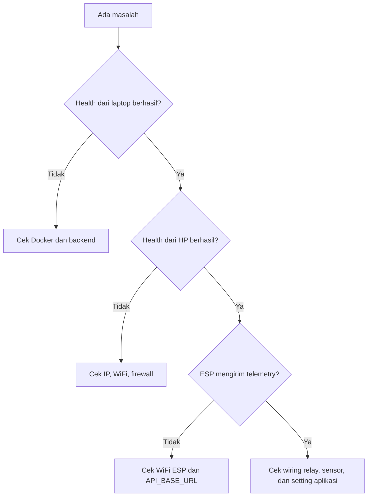

# 07 - Troubleshooting

[Beranda](../README.md) |
[1 Persiapan](01_PERSIAPAN.md) |
[2 Server Lokal](02_INSTALASI_SERVER_LOKAL.md) |
[3 Android](03_SETUP_APLIKASI_ANDROID.md) |
[4 ESP8266](04_SETUP_ESP8266.md) |
[5 Wiring](05_WIRING_RANGKAIAN.md) |
[6 Penggunaan](06_CARA_PENGGUNAAN.md) |
[7 Troubleshooting](07_TROUBLESHOOTING.md) |
[8 Checklist](08_CHECKLIST_CLIENT.md)

Gunakan tabel ini saat sistem belum berjalan.

Kerjakan dari penyebab yang paling sederhana dulu.

## Tabel masalah umum

| Masalah | Penyebab kemungkinan | Cara cek | Solusi |
| ------- | -------------------- | -------- | ------ |
| Docker tidak berjalan | Docker Desktop belum dibuka | Buka Docker Desktop | Jalankan Docker Desktop lalu tunggu sampai siap |
| Docker tidak berjalan | Laptop belum restart setelah install | Docker error saat `docker compose up -d` | Restart laptop |
| Port 3000 dipakai aplikasi lain | Ada backend lain berjalan | Jalankan `netstat -ano \| findstr :3000` | Tutup aplikasi lain atau ubah port backend |
| HP tidak bisa membuka `/api/health` | HP beda WiFi dengan laptop | Cek WiFi HP dan laptop | Sambungkan ke WiFi/hotspot yang sama |
| HP tidak bisa membuka `/api/health` | Firewall memblokir Node.js | Test health dari laptop berhasil, dari HP gagal | Izinkan Node.js di Windows Firewall untuk Private network |
| IP laptop berubah | Laptop pindah jaringan | Jalankan `ipconfig` | Update IP di APK dan `config.h` |
| APK Offline | IP salah | Buka `http://IP_LAPTOP:3000/api/health` dari HP | Isi IP laptop yang benar di APK |
| APK Offline | Backend belum hidup | Terminal backend tidak berjalan | Jalankan `.\scripts\start-local.bat` |
| ESP tidak terhubung WiFi | SSID atau password salah | Serial Monitor menunjukkan WiFi failed | Perbaiki `WIFI_SSID` dan `WIFI_PASSWORD` di `config.h` |
| ESP tidak terhubung WiFi | WiFi 5GHz only | ESP tidak pernah connect | Gunakan WiFi 2.4GHz |
| ESP gagal mengirim telemetry | `API_BASE_URL` salah | Cek `config.h` | Gunakan `http://IP_LAPTOP:3000/api` |
| ESP gagal mengirim telemetry | Backend tidak bisa diakses ESP | Test health dari HP gagal | Perbaiki jaringan/firewall/backend |
| DHT11 terbaca `NaN` | Kabel DATA salah | Cek wiring DHT11 ke D4 | Perbaiki kabel dan power |
| DHT11 terbaca `NaN` | Library DHT belum benar | Compile firmware error | Install DHT sensor library dan Adafruit Unified Sensor |
| Soil moisture tidak masuk akal | Sensor belum dikalibrasi | Nilai selalu 0% atau 100% | Ubah `SOIL_RAW_DRY` dan `SOIL_RAW_WET` |
| Soil moisture tidak masuk akal | AO tidak ke A0 | Cek kabel soil sensor | Sambungkan AO ke A0 |
| Relay aktif terbalik | Modul relay active HIGH | Pompa ON saat status OFF | Ubah `RELAY_ACTIVE_LOW` menjadi `false` |
| Pompa tidak menyala | Power pompa kurang | Relay klik tapi pompa diam | Gunakan power supply sesuai pompa |
| Pompa tidak menyala | Kabel relay salah | Relay tidak mengalirkan daya | Cek COM dan NO relay |
| Data histori tidak tampil | Belum ada telemetry masuk | Dashboard kosong | Pastikan ESP mengirim telemetry |
| Data histori tidak tampil | Aplikasi masih Mode Demo | Status memakai demo | Aktifkan Server Lokal |
| Mode otomatis tidak menyiram | Soil moisture belum di bawah threshold | Dashboard soil masih tinggi | Test dengan sensor di kondisi kering |
| Mode otomatis tidak menyiram | Cooldown masih aktif | Baru saja menyiram | Tunggu cooldown selesai |
| Jadwal tidak berjalan | Jadwal belum aktif | Cek daftar jadwal | Aktifkan jadwal |
| Jadwal tidak berjalan | Waktu perangkat tidak sesuai | Jadwal lewat tapi tidak jalan | Cek waktu laptop dan ESP |

## Alur pengecekan cepat



## Command cek cepat

Cek Docker:

```powershell
docker compose ps
```

Cek port 3000:

```powershell
netstat -ano | findstr :3000
```

Cek IP laptop:

```powershell
ipconfig
```

Test health dari laptop:

```powershell
Invoke-RestMethod http://localhost:3000/api/health
```

## Peringatan keamanan

> [!WARNING]
> Jangan uji pompa langsung dengan listrik rumah.
> Gunakan pompa DC kecil untuk tahap awal.

> [!IMPORTANT]
> Jangan hapus data Docker dengan `docker compose down -v` jika data masih dibutuhkan.

## Lanjut

Jika semua masalah sudah selesai, buka:

[08 - Checklist Client](08_CHECKLIST_CLIENT.md)

[Beranda](../README.md) |
[1 Persiapan](01_PERSIAPAN.md) |
[2 Server Lokal](02_INSTALASI_SERVER_LOKAL.md) |
[3 Android](03_SETUP_APLIKASI_ANDROID.md) |
[4 ESP8266](04_SETUP_ESP8266.md) |
[5 Wiring](05_WIRING_RANGKAIAN.md) |
[6 Penggunaan](06_CARA_PENGGUNAAN.md) |
[7 Troubleshooting](07_TROUBLESHOOTING.md) |
[8 Checklist](08_CHECKLIST_CLIENT.md)
